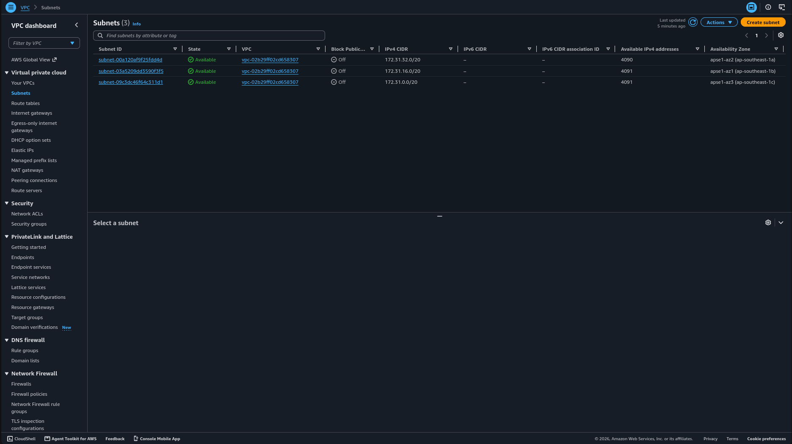
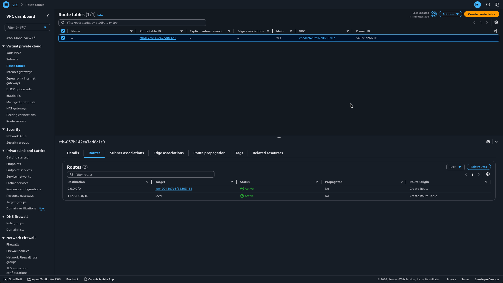
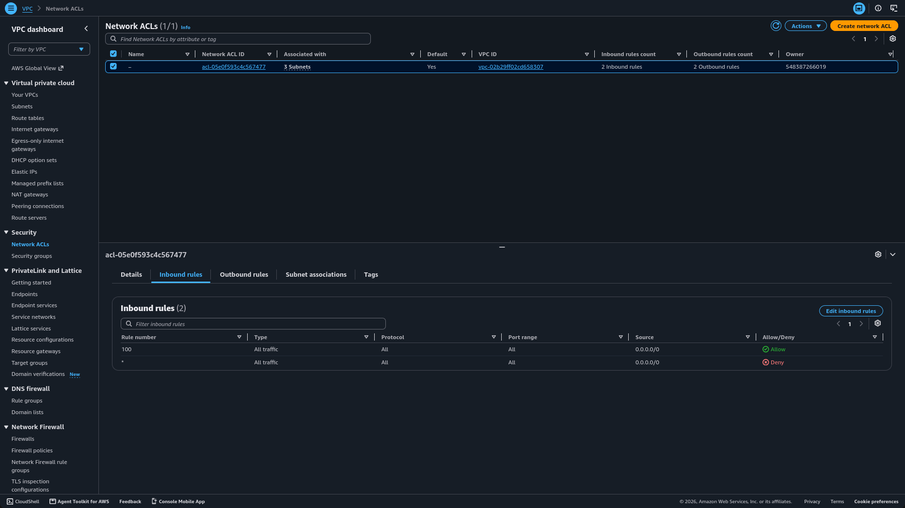
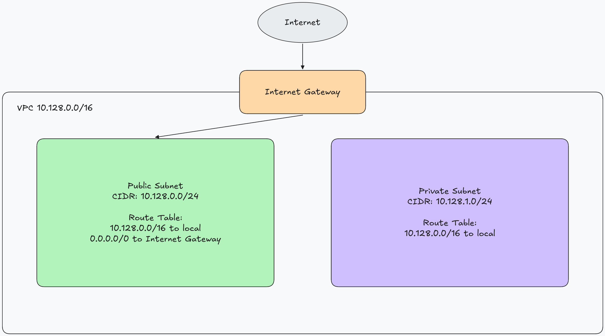

# Assignment 2 Submission

## About me

- GitHub username: vivrelavie
- Section: IV-DCSAD
- IAM user name that I signed in with: dcsad-g04
- X: 128

---

## Part A. Explore

### A1. The VPC

Default VPC IPv4 CIDR:

172.31.0.0/16

Number of addresses in that CIDR:

65,536

### A2. The subnets

| Availability Zone | IPv4 CIDR      |
| ----------------- | -------------- |
| ap-southeast-1a   | 172.31.32.0/20 |
| ap-southeast-1b   | 172.31.16.0/20 |
| ap-southeast-1c   | 172.31.0.0/20  |

Screenshot 1. Save it as `screenshot-1-subnets.png` in your folder. The image line below shows it.

### A3. Available addresses

Available IPv4 addresses in each subnet:

| Availability Zone | Available IPv4 addresses |
| ----------------- | ------------------------ |
| ap-southeast-1a   | 4090                     |
| ap-southeast-1b   | 4091                     |
| ap-southeast-1c   | 4091                     |

Why is the number lower than 4,096?

AWS reserves 5 addresses in every subnet. A /20 (4,096 total) shows at most 4,091 available. ap-southeast-1a shows 4,090 because one of those available addresses is already in use.

What uses the missing address in the subnet with the lowest number?

ap-southeast-1a shows 4,090 available IPv4 addresses because the EC2 instance from Lab 2 is running in that subnet and is using one private IP address.

### A4. The route table

| Destination   | Target                |
| ------------- | --------------------- |
| 0.0.0.0/0     | igw-0943e7e6f88293168 |
| 172.31.0.0/16 | local                 |

Screenshot 2. Save it as `screenshot-2-routes.png` in your folder. The image line below shows it.

### A5. Public or private

Are the default subnets public or private? Which route proves it?

The default subnets are public because the route 0.0.0.0/0 points to an internet gateway, which sends all non-local traffic out to the internet.

### A6. The internet gateway

State of the internet gateway:

Attached

What happens to the default subnets if the gateway is detached?

The default subnets would no longer be public, because the 0.0.0.0/0 route would become a blackhole and instances in them could no longer reach the internet.

### A7. NAT gateways

Number of NAT gateways:

0

Can a server in a new private subnet download updates? Why?

No, a server in a new private subnet could not download updates from the internet, because there is no NAT gateway to translate its outbound traffic and the private subnet would have no route to the internet gateway.

### A8. The network ACL

| Rule number | Source    | Allow or Deny |
| ----------- | --------- | ------------- |
| 100         | 0.0.0.0/0 | Allow         |
| *           | 0.0.0.0/0 | Deny          |

How is a network ACL different from a security group?

A network ACL works at the subnet level and is stateless, while a security group works at the instance (network interface) level and is stateful.

Screenshot 3. Save it as `screenshot-3-network-acl.png` in your folder. The image line below shows it.

### A9. The default security group

Inbound rule (type and source):

Type: All traffic
Source: sg-0c5b6d4081cf0a534 / default

Which resources can send traffic to an instance that uses it?

Only resources that are members of this same default security group can send traffic to an instance that uses it, because the rule's source is the group itself rather than an IP range, so traffic from the internet or from instances in other security groups is not allowed.

---

## Part B. Prepare

### B1. Plan two subnets

- Public subnet CIDR: 10.128.0.0/24
- Private subnet CIDR: 10.128.1.0/24

### B2. Route tables

Route table of the public subnet:

| Destination   | Target           |
| ------------- | ---------------- |
| 10.128.0.0/16 | local            |
| 0.0.0.0/0     | internet gateway |

Route table of the private subnet:

| Destination   | Target |
| ------------- | ------ |
| 10.128.0.0/16 | local  |

### B3. My VPC diagram

Tool used (Excalidraw, draw.io, Lucidchart, or paper):

Excalidraw

Save your diagram as `vpc-diagram.png` in your folder. The image line below shows it.

### B4. Predict a change

Can you still open the web page from your laptop? Why?

No, you can no longer open the web page. Without the 0.0.0.0/0 route to the internet gateway, the subnet has no path to the internet, so the instance's replies cannot get back to my laptop even though it still has a public IPv4 address.

Can the instance still reach another instance in the VPC? Why?

Yes, it still can. The 172.31.0.0/16 local route is separate from the 0.0.0.0/0 route, so traffic inside the VPC keeps working as long as the security groups allow it.

### B5. Place a database

Which subnet gets the database? Why?

The database goes in the private subnet. Its route table has only the local route, so nothing on the internet can reach it directly. The web server in the public subnet can still connect to it through the local route.

### B6. My question about VPCs

What is your question, and what made you think of it?

What happens to existing connections if the internet gateway is detached while someone is loading the web page? I thought of it because we only discussed what happens after the detachment, not during a active session.
